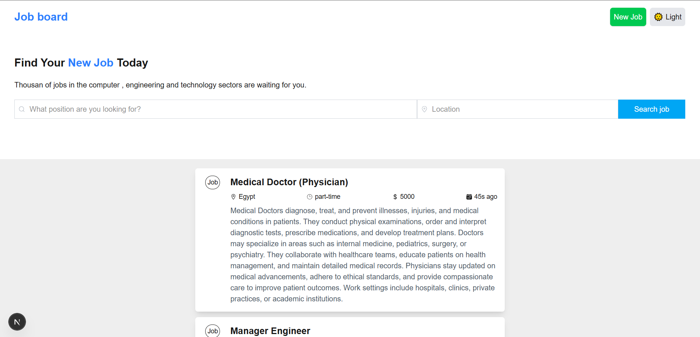
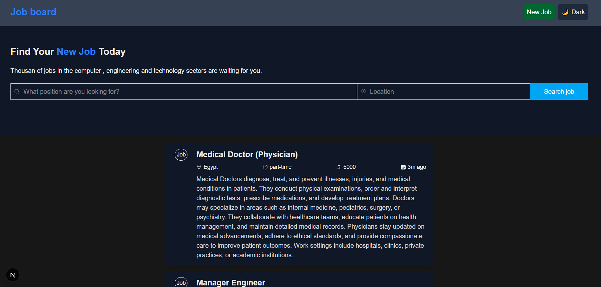
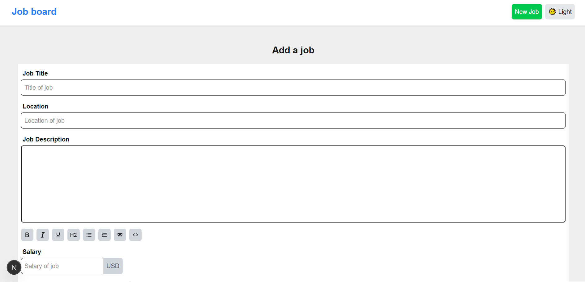

# 💼 Career Connect - Frontend (React + Next.js)

Career Connect is a modern front-end application that enables users to browse, create, and manage job listings. Built with **React**, **Next.js**, and **Tailwind CSS**, it offers a seamless user experience and fast performance.

---

## 📸 Screenshots

### Home Page


### Dark Mode


### Job Details Page


---

## 🚀 Features

- ✅ Job creation and editing
- 🔍 Advanced job search and filters
- 👤 User authentication and authorization
- 🌐 Fully responsive design
- ⚡ Fast page load with Next.js optimization

---

## 🧰 Tech Stack

- **Next.js** – React framework for production
- **React** – JavaScript UI library
- **Tailwind CSS** – Utility-first CSS framework
- **tiptap** – Rich text
- **React Hook Form + Zod** – Form handling and validation
- **TypeScript** – Strong typing for scalable code

---

## 📦 Installation

1. **Clone the repository**
   ```bash
   git clone https://github.com/mina-8/Job-Board.git
   cd career-connect-frontend
